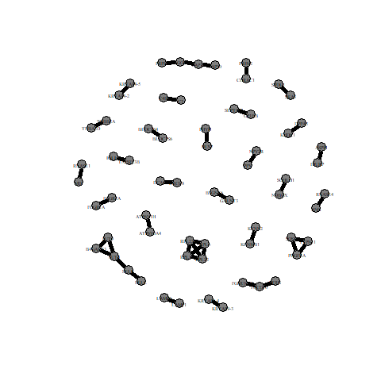

<div align="center">
    <h1>PolyGenNet-</h1>
    
</div>


# Introduction

PolyGenNet- is a computational framework designed to analyze and visualize **gene-gene interaction networks** in the context of complex human traits. The platform integrates multiple datasets to uncover trait-specific variations in gene interactions and provides an accessible interface for both exploratory analysis and hypothesis-driven research.


## Article Related to PolyGenNet-

**Title**: 
Trait-Specific Variations in Gene Interaction Networks Underlying Complex Human Traits  

**Authors**: 
Ehsan Tamandeh, Johannes Schumacher, Carlo Maj, Pouria Dasmeh


## 
This project is inspired by and associated with the research presented in the paper **Trait-Specific Variations in Gene Interaction Networks Underlying Complex Human Traits**. 

The work explores the interplay between gene networks and complex human traits, revealing trait-specific patterns of genetic interaction. 

We then wanted to see whether the characteristics  we observed between **associated and non-associated** networks also extend to a broader spectrum of complex traits.  


The repository contains tools and scripts used in the analysis of this study.


## Associated Gene-Gene Interaction Networks examples: 
<div style="display: flex; gap: 10px;">
  
  
</div>

## Non-associated Gene-Gene Interaction Networks examples: 
<div style="display: flex; gap: 10px;">
  
  
</div>

For further reading, you can refer to the full article [here](link-to-the-article).

## Table of Contents
- [Project Overview](#Project_Overview)
- [Installation](#installation)
- [Features](#features)
- [Contact](#contact)

## Project Overview

Our analysis began with the compilation of gene names and their associations with various traits using **Genome-Wide Association Studies (GWAS)**. 
To evaluate the strength of these associations, we employed confidence scores: scores below 0.4 indicate a weak association, scores around 0.7 suggest a moderate association, and scores above 0.9 denote a strong association between a gene and a trait.

Focusing on traits with high-confidence gene associations, we identified those with at least 60 genes scoring above 0.9, which refined our analysis to 461 traits out of the 4,756 initially available in the GWAS data. The dataset also included a total of 20,188 genes.

To construct the interaction networks for each trait, we calculated the gene-gene interaction network adjacency matrix using the GWAS data. This matrix provided a detailed statistical representation of the interactions within each network. For further validation and visualization, we also utilized data from the STRING database.


## Analysis Scheme Overview :

**Gene Selection:**

We categorized genes based on their confidence scores. 
Genes with the highest scores in a trait were labeled as **"associated genes"**, while those with lower scores were termed **"non-associated genes"**.


**Interaction Compilation:** 

We gathered all possible gene interactions for each selected trait using GWAS, ensuring a comprehensive representation of gene interactions across a wide range of organs and biological systems.
Network Analysis: We analyzed the structure of these gene-gene interaction networks by calculating the number of "interactions" within the network. This analysis allowed us to distinguish between "connected genes," which represent genes that interact with others, and "isolated genes," representing genes without interactions.


**Comparative Analysis:** 

For each trait, we calculated two sets of values—one for associated genes and another for non-associated genes—covering the **number of connected genes, isolated genes, gene-gene interactions, and the highest degree** within the network. Comparing these values enabled us to draw insights into the differences in network structures between associated and non-associated genes.


**Degree Distribution and Network Structure:** 

We investigated the degree distribution of connected and isolated genes to better understand the network dynamics. 
The degree distribution analysis was essential for exploring the relationship between connected and isolated genes within these networks.
Network Structure Identification: To determine the optimal network structure, we applied the Akaike Information Criterion (AIC) method. By evaluating the AIC values for various potential structures and selecting the one with the lowest AIC, we identified the most appropriate network structure for each trait's gene-gene interaction network.


## Installation

To install and set up the PolyGenNet- framework on your local machine, follow these steps:

1. The **"STRING db"** (https://www.string-db.org) is a database of known and predicted protein-protein interactions. The interactions include direct (physical) and indirect (functional) associations. The database contains information from numerous sources, including experimental repositories, computational prediction methods and public text collections. Each interaction is associated with a combined confidence score that integrates the various evidences.

    To install the "STRING db" package, start R (version "4.4") and enter:
   ```bash
   if (!require("BiocManager", quietly = TRUE))
       install.packages("BiocManager")

   BiocManager::install("STRINGdb")
   ```

3. The **"g:Convert"** is a feature within the "gprofiler" package suite that allows for mapping between different biological identifiers such as genes, proteins, microarray probes, and database-specific identifiers.
   It supports mapping across numerous databases (e.g., Ensembl, UniProt, NCBI, etc.) and for a wide range of species.

   Key Use Cases of g:Convert:
   
   Gene/Protein Identifier Conversion: Map identifiers across different formats, like converting Ensembl gene IDs to gene symbols or UniProt IDs.
   Cross-Species Mapping: Transfer gene/protein information from one organism to another when homologous relationships are known.
   Unifying Data Sources: Standardize identifiers when working with datasets from different sources that use varied naming conventions.
   
   Example Mappings:
   Gene to Protein ID: Convert gene symbols (like BRCA1) to corresponding UniProt or Ensembl IDs.
   Microarray Probes to Gene Symbols: Map probe IDs from microarray data to gene names for further analysis.

   To install the "g:Profiler" package in R enter:
   ```bash
   install.packages("gprofiler2")
   ```


## Features

In gene interaction networks, genes and gene products interact with each other through physical and functional connections, forming complex networks. 
These networks exhibit properties such as modularity and scale-free topology, where a few highly connected genes (hubs) play critical roles in maintaining cellular functions. 
Variations in these hubs or their interactions can have cascading effects on the network, leading to phenotypic changes associated with diseases. For instance, genes involved in Schizophrenia (SCZ) or other complex diseases often participate in common pathways or modules within the gene interaction network, even though the specific mutations may differ across patients.


## Contact

 Please do not hesitate to contact me if you require any further information: 
 
 Ehsan Tamandeh
 Email: ehsan.tamandeh007@gmail.com
 


## Acknowledgments

Special thanks to my supervisors Johannes Schumacher, Carlo Maj, and Pouria Dasmeh for their contributions to the research behind this project.
